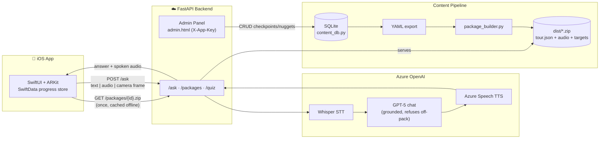
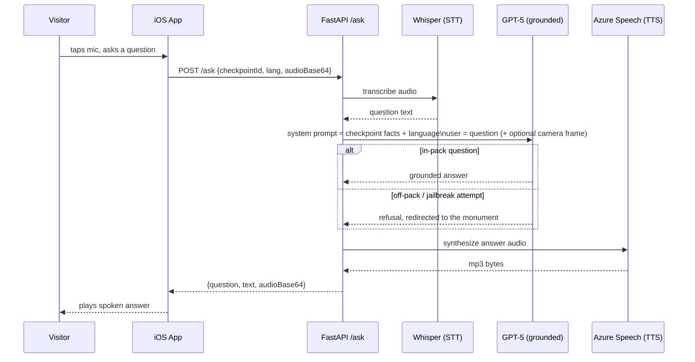

# Marauders — AI District Tour Guide

**An offline-first AR + voice tour guide.** Point your phone at a monument, ask it
anything, hear a grounded answer in your language, in seconds — no network
required for the core tour.

Built in 48 hours at a hackathon by team **Kyrex**. Two independent apps living
side by side in this workspace: a SwiftUI/ARKit iOS app and a FastAPI backend
that turns curated tour content into offline packages and answers live
questions with Azure OpenAI.

[](LICENSE)
[](backend/requirements.txt)
[](frontend/README.md)
[](backend/ask_service.py)

---

## Table of Contents

- [What it does](#what-it-does)
- [Architecture](#architecture)
- [How a question gets answered](#how-a-question-gets-answered)
- [Repo structure](#repo-structure)
- [Quick start](#quick-start)
- [API reference](#api-reference)
- [Environment variables](#environment-variables)
- [Content pipeline](#content-pipeline)
- [Examples](#examples)
- [Tech stack](#tech-stack)
- [Roadmap](#roadmap)
- [Security](#security)
- [License](#license)

## What it does

- **Walk up, point, ask.** ARKit recognizes a printed/physical checkpoint and
  surfaces the right nugget of information — audio, in the visitor's language.
- **Voice Q&A, grounded.** Ask anything about what's in front of you; the
  backend answers strictly from that checkpoint's curated facts and *refuses*
  to invent history (verified against jailbreak prompts, not just happy-path
  questions).
- **Works with the network off.** The entire tour — text, audio, AR targets —
  downloads once as a zip and plays back with zero server calls. Only the
  live Q&A needs a connection.
- **Multilingual out of the box.** English, Hindi, French, and Spanish content
  and speech, translated and voiced through the same pipeline.
- **A living content pipeline.** A login-gated admin panel edits checkpoints
  and nuggets in SQLite; one click rebuilds and republishes the offline
  package — no redeploy needed to change what the tour says.

Three demo properties ship with the content pipeline: the **Taj Mahal**, a
**Zomato Farmhouse** venue tour, and a National War Memorial mock — the first
two have live, fully-produced backend packages (audio, AR targets, GPS).

## Architecture



**[🎨 Open the interactive, hand-drawn version on Excalidraw →](https://excalidraw.com/#json=PJfoqK71h4pkoHUWzXEO4,h0K9TudENbRd6cfaX10AKg)**

The core design decision: **the app never depends on the network for the tour
itself.** Everything a visitor needs — narration, images, AR targets — is
baked into one zip at build time. The backend only stays in the loop for the
open-ended "ask me anything" voice feature, and even that degrades gracefully
(cached content keeps playing if the connection drops mid-tour).

## How a question gets answered



Every `/ask` call is logged with latency in milliseconds; grounding was
verified with a 6/6 transcript (3 in-pack, 3 adversarial off-pack prompts —
see `backend/REPORT.md`).

## Repo structure

```text
hackathon/
├── backend/                  FastAPI service + content pipeline (own git repo)
│   ├── ask_service.py         /ask, /packages, /quiz, /health
│   ├── admin_panel.py         SQLite-backed CRUD admin API
│   ├── admin.html             Login-gated Content Studio UI
│   ├── package_builder.py     content/*.yaml -> dist/*.zip (audio + targets)
│   ├── content_db.py          SQLite schema + YAML import/export
│   ├── content/               taj_mahal.yaml, zomato_farmhouse.yaml
│   ├── targets/               AR reference images
│   ├── nugget_images/         WebP flashcard images
│   ├── examples/              sample client code (see below)
│   └── .env.example           copy to .env and fill in Azure keys
│
├── frontend/                  Marauders iOS app (own git repo)
│   ├── Marauders/
│   │   ├── App/                entry point, root flow
│   │   ├── Core/                design system, models, services
│   │   ├── Features/            auth, bookings, map, AR camera, audio, profile
│   │   └── Resources/           assets, bundled demo package, localization
│   ├── MaraudersTests/         Swift Testing unit tests
│   └── Secrets.xcconfig.example
│
├── BUILD_BRIEF_district_tour_guide.md   original product brief
├── EXECUTION_PLAN.md                    hackathon build plan
├── SEED_AND_DEPLOY.md                   deploy runbook
└── README.md                            you are here
```

`backend/` and `frontend/` are independent Git repositories (each with its own
history and remote) — clone whichever half you need, or both.

## Quick start

### Backend

```bash
cd backend
python3 -m venv .venv && source .venv/bin/activate
pip install -r requirements.txt
cp .env.example .env        # fill in your Azure AI Foundry keys

# build a demo package with no keys / no network (silent placeholder audio)
brew install ffmpeg
python package_builder.py --content content/taj_mahal.yaml --no-tts

uvicorn ask_service:app --host 0.0.0.0 --port 8000
curl http://localhost:8000/health
```

See [`backend/README.md`](backend/README.md) for the full setup (real TTS,
Azure Foundry deployments, LAN demo networking, admin panel).

### Frontend

```bash
cd frontend
cp Secrets.xcconfig.example Secrets.xcconfig   # fill in MARAUDERS_APP_KEY
open Marauders.xcodeproj
```

Build and run the `Marauders` scheme on an ARKit-capable iPhone (a physical
device is required to verify image tracking). See
[`frontend/README.md`](frontend/README.md) for demo login, tests, and the AR
camera/browse-mode design.

## API reference

| Method | Path | Auth | Purpose |
|---|---|---|---|
| `GET` | `/health` | — | Liveness + per-monument content version |
| `GET` | `/packages/{monumentId}.zip` | — | Full, all-language offline package |
| `GET` | `/packages/{monumentId}/{lang}.zip` | — | Language-scoped package (smaller download) |
| `POST` | `/ask` | `X-App-Key` | Grounded Q&A: text, recorded audio, or a camera frame in → answer + speech out |
| `GET` | `/quiz/{monumentId}` | `X-App-Key` | Structured multiple-choice quiz generated from checkpoint facts |
| `POST` | `/admin/rebuild` | `X-App-Key` | Re-run the package builder and refresh `/packages` |
| `GET` | `/admin` | `X-App-Key` | Content Studio dashboard (HTML) |
| `GET/POST/DELETE` | `/admin/monuments`, `/admin/checkpoints`, `/admin/nuggets`, `/admin/content`, `/admin/export` | `X-App-Key` | Full CRUD over tour content |

`POST /ask` request/response shape:

```jsonc
// request
{
  "monumentId": "taj_mahal",
  "checkpointId": "cp_main_platform",
  "lang": "en",              // en | hi | fr | es
  "text": "Why does the marble glow?",   // OR audioBase64, OR imageBase64
  "skipAudio": false          // true = text-only chatbot fast path
}
// response
{ "question": "...", "text": "...", "audioBase64": "..." }  // mp3, base64
```

## Environment variables

All in `backend/.env` (copy from `backend/.env.example`, never commit it):

| Variable | Purpose |
|---|---|
| `AZURE_OPENAI_ENDPOINT` / `AZURE_OPENAI_API_KEY` | Azure AI Foundry resource for chat + Whisper |
| `AZURE_GPT_DEPLOYMENT` | Chat model deployment name (picked by `bench_models.py`) |
| `AZURE_WHISPER_DEPLOYMENT` | Speech-to-text deployment |
| `CHAT_DEPLOYMENTS` | Comma-separated candidates for the model bench |
| `APP_KEY` | Shared secret required as `X-App-Key` on `/ask`, `/quiz`, `/admin/*` — unset only for local dev |
| `TTS_PROVIDER` | `speech` (Azure Speech, recommended for Hindi) or `openai` |
| `AZURE_SPEECH_KEY` / `AZURE_SPEECH_REGION` | Azure Speech resource, if `TTS_PROVIDER=speech` |
| `SPEECH_VOICE_EN` / `_HI` / `_FR` / `_ES` | Per-language neural voice |
| `AZURE_TTS_DEPLOYMENT` / `OPENAI_TTS_VOICE` | Used only when `TTS_PROVIDER=openai` |

The iOS side needs exactly one secret, in `frontend/Secrets.xcconfig` (copy
from `Secrets.xcconfig.example`): `MARAUDERS_APP_KEY`, matching the backend's
`APP_KEY`.

## Content pipeline

Tour content is authored once and flows through one path to every surface:

```text
SQLite (content_db.py, admin.html CRUD)
  → export to content/*.yaml
    → package_builder.py (translation + TTS + AR targets + WebP images)
      → dist/{monument}[_{lang}].zip
        → served at /packages, bundled in the iOS app for offline use
```

Every field added since the hackathon's first pass has been strictly
additive — older packages keep decoding on newer app builds, and the
all-language endpoint's behavior has never changed shape. See
`backend/CLAUDE.md` and `backend/REPORT.md` for the full build history and
the evidence behind each phase.

## Examples

Sample client code lives in [`backend/examples/`](backend/examples/):

- `ask_demo.sh` — curl walkthrough of every endpoint, including an
  off-pack jailbreak attempt that gets refused instead of answered
- `ask_client.py` — a small Python client for text, recorded audio, or a
  camera-frame question

## Tech stack

| Layer | Choice |
|---|---|
| iOS app | Swift, SwiftUI, ARKit, SwiftData, Swift Testing |
| Backend | Python, FastAPI, Uvicorn |
| LLM / speech | Azure OpenAI (GPT-5, Whisper), Azure Cognitive Speech |
| Content store | SQLite (authoritative) → YAML (pipeline input) |
| Packaging | Custom Python builder → static zip (audio, images, AR targets, `tour.json`) |
| Hosting | Azure App Service (LAN-first demo networking; cloud as redundancy) |
| Diagrams | Mermaid (this README) + [Excalidraw](https://excalidraw.com) |

## Roadmap

- On-device Foundation Models for a fully offline Q&A fallback (no backend
  call at all), with on-device embeddings for retrieval at 100+ monument scale
- Fluent-speaker QA pass on the French/Spanish machine translation
- A join-table shape for nugget images (current `images_json` column is the
  "ship tonight" version, noted as a followup in `backend/CLAUDE.md`)

## Security

Real credentials live only in `backend/.env` and `frontend/Secrets.xcconfig`
— both gitignored, never committed. See `.env.example` /
`Secrets.xcconfig.example` for the shape each expects. If you're forking this
for your own deployment, generate your own `APP_KEY` and Azure resource keys;
don't reuse anything that ever appeared in this repo's history.

## License

[MIT](LICENSE) — see the `LICENSE` file in each of `backend/` and `frontend/`
for their independent repos.
